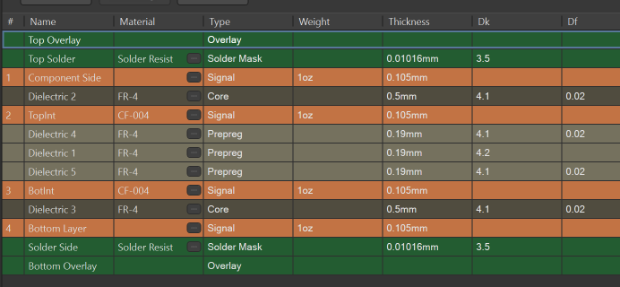

![[Ресурс 1.bmp]]
> [!abstract] Требования к проектированию электронных устройств в AltiumDesigner:

```table-of-contents
```
## Библиотеки

### Библиотеки компонентов, шаблоны схем, шаблоны плат, скрипты  

Содержимое репозитория:
- **/altlib** - файлы библиотек AltiumDesigner 
- **/files** - примеры и шаблоны файлов для удобства проектирования в соответствии с гайдом
- **/guide** - файлы самого гайда (obsidian)
- **/pcb_checker** - скрипт для автоматизированной проверки соответствия репозитория гайдам, а также общие проверки исходных файлов (помогает избежать досадных ошибок при отправке на производство, встраивается в CI для автоматизации этих процессов )
- **/pcb_specgen** - генератор документации по ЕСКД (условно соответствует )

 Для работы необходимо использовать набор библиотек из папки `altlib`:
- **/schlibs** - библиотека условно графических отображений УГО
- **/pcblibs** - библиотеки топологческих посадочных мест ТПМ (Footprints)
- **/enclosures** -  корпуса для РЭА с 3D моделями и шаблоны печатных плат к ним 
- **/pcb** - `.stackup` файлы для плат разной толщины и слойности 
- **/sch_template** - шаблоны листов схем 
- **/flowchart** - библиотека блок схем
- **/scripts** - скрипты Altium 

### Работа с библиотеками 

Перед началом проектирования устройства требуется посредством git клиента забрать последнюю версию из master ветки репозитория с библиотеками. После завершения проектирования устройства вновь добавленные компоненты требуется слить назад в новую ветвь с названием проекта в котором были добавлены изменения, а в информации к коммит написать что было добавлено.  
### Правила добавления новых УГО и ТПМ компонентов:

*  Добавлять компонент необходимо в уже имеющиеся категории библиотечных файлов `xxx.schlib ` для УГО  +  соотвествующий ей файл `xxx.pcblib` для ТПМ. Если компонент не соответствует ни одной из предложенных категорий то добавляем в `other.schlib` + `other.pcblib`
*  Длина выводов компонента должна быть 5мм.  
*  Сетка должна быть метрическая 2.5мм. 
*  Подписи всех компонентов и названия выводов должны быть выполнены шрифтом GOST_type A, 10, обычный.
*  При начертании УГО необходимо стилистически соответствовать ЕСКД там где это возможно (допускается не полное копирование).
*  Допускается размещение графики только в соответствующих слоях, предназначенных для этой графики 
*  При добавлении ТПМ требуется добавление 3D модели компонента: [здесь есть большинство моделей](https://www.3dcontentcentral.com), если реалистичной модели найти не удалось то необходимо штатными средствами  AltiumDesigner отрисовать примитив. Добавлять модель требуется в слой `Top3D` или  `Bot3D`  

## Работа с проектом 
### Оформление репозитория с проектом 

 
Файлы истории и превью необходимо УДАЛИТЬ перед тем как делать комит для этого создать `.gitignore` файл. Пример такого файла в папке `files/`, содержимое файла ниже.

```
/hardware/__Previews/
/doc/__Previews/
/doc/drawing/Status Report.Txt
/hardware/History/
.read
.open
open
read
/hardware/Project Logs for *
/hardware/Project Outputs for *
Status Report*
*Status Report.Txt
*.bak
*.bkp
```

Готовый файл который можно просто положить в корень репозитория находится в  [files/.gitignore](https://github.com/RoboticsHardwareSolutions/altguide/tree/main/files)
### Название и назначение слоев в библиотеках и печатных платах

В библиотеках xxx.pcblib и двухслойных печатных платах требуется соблюдать следующие слои:
Слой шелкографии, паяльной маски и пасты оставляется по умолчанию

#### Названия слоев 2x слойных плат:

![[two_layers2.png]]
![[two_layers-2.png]]
* `Board`     -  слой содержащий контур печатной платы.      
* `Plata`     -  слой для размещения дополнительной графки (не обязательно).   
* `TopAssy`   -  слой для сборочного чертежа с контурами компонентов (не обязательно при наличии 3D модели компонента)
* `BotAssy`   -  слой для сборочного чертежа с контурами компонентов (не обязательно при наличии 3D модели компонента)
* `Top3D`     -  слой с добавленными 3D моделями компонентов
* `Bot3D`     -  слой с добавленными 3D моделями компонентов
* `Board3D`   -  слой с 3D моделью печатной платы (если плата имеет сложный контур, вырезанный по модели)

#### Названия слоев 4x слойных плат:

![[four_layers.png]]

Остальные слои аналогично варианту 2x слойной
### Принципиальные схемы 

#### Декомпозиция схем проекта 

При проектировании схем необходимо руководствоваться принципом  повторного использования листов схем и декомпозировать на логически связанные узлы элементов и размещать их в рамках одного листа 

Пример - проект устройства  на микроконтроллере можно декомпозировать на следующие листы:  

* лист `dcdc_ldo.schdoc` - содержит принципиальную схему преобразователя питания + линейный стабилизатор 
* лист `mcu.schdoc` - содержит принципиальную схему микроконтроллера с неоходимой обвязкой 
* лист `io.schdoc` - содержит принципиальную схему внешних входов выходов согласующих уровни МК с внешними сигналами.

#### Правила проектирования принципиальных схем 

* Все УГО и ТПМ из библиотеки `/schlibs/` и `/pcblibs/` перед установкой на лист схемы дожны быть проверены на соответвие документации.
* Размещение компонетов необходимо производить в сетке 2.5мм
* Все подписи на принципиальной схеме требуется выполнять шрифтом GOST_type A, 10, обычный.
* При проектирование принципиальных схем требуется использовать предоставленные шаблоны в `/sch_template/` (заполнение рамки  не является необходимостью)
* Рекомендуемый типо-размер пассивных SMD компонентов не мельче 0603
* Если в устройстве стоит микроконтроллер с интерфейсом SWD (STM32) требуется установить типовой разьем c шагом 2.54мм c соблюдением распиновки:  

![[swd.png]]

*  pin 1 - `3.3V` - напряжение питание микроконтроллера.   
*  pin 2 - `SWDIO` - линия данных интерфейса SWD.      
*  pin 3 - `SWCLK` - линия тактировапния интерфейса SWD. 
*  pin 4 - `SWO` - линия выход данных последовательного интерфейса.  
*  pin 5 - `GND` - земля.  

Ножка `reset` не нужна  100% :).

### Правила проектирования печатных плат

* Требуется использовать название и назначение слоев из предыдущих пунктов 
* При проетироввании платы рекомендуется использовать односторонний монтаж компонентов (`иное согласовывается!`)
* Рекомендуется использовать не более 6 разных диаметров отверстий на печатной плате 
* Диаметр отверстий не менее 0.25мм 
* Минимальная ширина проводника на внешних слоях 0.2 мм и более 
* Минимальная ширина зазора на внешних слоях 0.2мм и более 
* Пояски контактных площадок (Annular ring) 0.25 мм и более
* Рекомендуется использовать типовой набор переходных отверстий `1: 0.3 отв. - 0.7 наруж.` , `2: 0.7 отв. - 1.3 наруж.` - отверстия необходимо закрывать паяльной маской если нет специфичных требований.
* Cтрого необходимо наносить шелкографическую маркировку на плату c позиционными обозначениями компонентов (иное согласовывается)
* Рекомендуемый размер шрифта шелкографии : толщина - 0.18мм, высота - 0.7мм 
* На плате должна быть нанесена версия печатной платы в соответствии с рекомендацией по семантическому версионированию : `HW 1.0.0`
* Если в составе устройства присутствует разъем для программирования, то необходимо наносить распиновку как на фото выше

## Документация

### Общая структура документации

Итоговой комплект документации должен иметь следующую структуру и название файлов (не включенное в список требутся удалить!):

![[doc.png]]

* `/doc/` - cодержит документацию относящуюся к проекту  (datasheet "**если** **нада**" вставлять в файл README.md в виде ссылок c корпоративного NAS/OneDrive/YandeksDisk ....)
	* `/drawing/` - содержит чертежи печатной платы (если требуются) и обязательно 3d модель печатной платы со всеми компонентами .step .stp
	* `/pcb/` - папка содержит документацию для печатной платы 
		* `Assembly Drawings.PDF` - файл содержит сборочные чертежи печатной платы для ручного монтажа генерируемые AltiumDesigner
		* [Draftsman.PDF](#Draftsman.PDF) - Монтажная схема - схема или сборочный чертеж, содержащий позиционные обозначения элементов и их ориентацию. 
		* `board_options.txt` - файл содержит информацию о печатной плате 5 пунктов  (толщина платы,толщина меди, колличество слоев, цвет паяльной маски, цвет шелкографической маркировки, тип покрытия)
		* `Bill of Materials-xxxxxx.csv` - файлы BOM (если имеются дополительные внешние разьемы или прочая фурнитура необходимо указать отдельным файлом ext_bom.csv)
		* `/gerber/` - папка содержит гербер файлы для производства, файл сверловки и файл контура.  
		* `Pick Place xxxxxx.csv` - файл для автоматического установщика компонентов.  
		* `Schematic Prints.PDF` - файл схемы проекта AltiumDesigner
		* `mount_requirements.xxx` -  чертеж или изображение специфичных требований к монтажу выводных компонентов. Пример ниже 
	* `/photo/` - содержит два фото печатной платы устройства - скриншоты Altium3DView в png (top.png и bot.png)
	* `/pinout/` - содержит реалистичное изображение печатной платы с указаниием распиновки разъемов в `pinout.png`.  Файл требуется рисовать используя Draw.io и сохранять как редактируемый `.png` файл.       
* `/hardware/` - содержит проект печатной платы `__.PrjPCB __.PcbDoc __.SchDoc` файлы.  (только файлы относящиеся к проекту. Файлы и папки истории бибилиотеки и прочий мусор не должны лежать в репозитории, CAM файлы и папки Preview , OutputLogs удалить).  
### Файл job

Файл [job.outjob](files/job.outjob) - содержит готовый шаблон для генерации всех требуемый файлов докеументации автоматически, будьте внимательны требуется незначительное редактирование в каждом отдельном случае в зависимости от количества слоев печатной палаты и прочих параметров. Готовый файл который можно просто положить в корень репозитория находится в  [files/job](https://github.com/RoboticsHardwareSolutions/altguide/tree/main/files)
### Файл mount_requirements

**Пример файла** `mount_requirements` - иллюстрирует требования к  монтажу выводных элементов в составе печатной платы 
![[mount_requirements.png]]
###  Файл README 

Файл [README.md](files/README.md) - который необходимо размещать в корне репозитория имеет типовое содержание и не нуждается в редактировании в случае использования типовой структуры репозитория. Скачать по сылке добавить в репозиторий - **нужно изменить только имя проекта** в большинстве случае если вы не хотите добавлять специфичную информацию.  Готовый файл который можно просто положить в корень репозитория находится в  [files/README](https://github.com/RoboticsHardwareSolutions/altguide/tree/main/files)
###  Файл board_options

Файл [board_options.txt](files/board_options.txt) - файл содержит пример необходимого описания структуры платы для заказа. Его содержимое также приведено ниже:

```toml
# в случае если плата не является типовой то поле type = "custom"
# для этого в репозитории должен содержаться файл board_options_draw.png 
# который иллюстрирует структуру и толщины слоев 


[board_options]
    length = 123               # длинна печатной платы по оси X в миллиметрах

    width = 100                # ширина печатной платы по оси Y в миллиметрах 

    type = "typical"           # тип печатной платы типовая или кастомная

    layers = 2                 # количесвтво слоев

    surface_finish = "ПОС63"   # покрытие контактных площадок

    pcb_color = "black"        # цвет паяльной маски печатной платы

    overlay_color = "white"    # цвет шелкографической маркировки

    pcb_thickness = 1.5        # толщина в милиметрах

    cooper_thickness = 35      # толщина меди в микрометрах

    solder_point = 1254        # колличество точек пайки на случай ручного монтажа

    drill_file_check = true    # Необязательное поле, по умолчанию true. Если
                               # нет файла сверловки, то необходимо отключить
                               # проверку этого файла. 
                               # Файл сверловки не гененрирруется если нечего
                               # сверлить!

    ext_bom = true             # значение true или false в зависимости от того,
                               # есть ли внешние коннекторы.
	                           # Если есть то обязательно наличие файла
	                           # ext_bom.csv с указанием доп фурнитуры 
                                   
```

Если сомневаетесь в синтаксической парвильности написания файла `board_options.txt` - поверьте с помощью онлайн валидатора [тут](https://www.toml-lint.com)    
В ситуации когда плата не является типовой (изготавливается попарным пресованием или имеет не стандарнтные толщины ) требуется указать в поле type = "custom" и приложить в папку doc/pcb файл - `board_options_draw.png`. Пример такого файла ниже:



Данный скриншот иллюстрирует полную структуру печатной кастомной платы общей толщиной 2 мм с нетиповой для производителя толщиной меди 105 um. 
Готовый файл который можно просто положить в корень репозитория находится в  [files/board_options](https://github.com/RoboticsHardwareSolutions/altguide/tree/main/files)
### Формат gerber и сверловки

![[gerber_format.png]]

![[gerber_layers.png]]

### Draftsman.PDF

**Создание файла**
1. Кликаем правой кнопкой мыши по проекту `Add New to Project -> Draftsman Document`
2. Выбираем шаблон (default) и жмем `OK`
3. Добавляем изделие с разных сторон и редактируем позиционные обозначения так, чтобы они были четко видны и точно определяли элементы, к которым относятся
4. Когда файл будет сохранен, можно будет сгененрировать на его основе .pdf файл из [job.outjob](files/job.outjob)

_Пример:_


### Структура bom.csv

**BOM обязательно должен содержать следующие столбцы !**

![[bom.png]]

### Cтруктура ext_bom.csv

**EXT BOM обязательно должен содержать следующие столбцы !**

Столбец **Сonnect to** - содержит УГО разъема на плате к кторому присоединяется коннектор

Пустой шаблон файла [тут](files/ext_bom.csv)

![[ext_bom.png]]


## Автоматизированная проверка доекментации  - СI

Ниже описывается проверка средствами github Action, по аналогии можно реализовать проверку в других git системах (gitlab). 

### Github Actions 

Создайте папки `.github/workflows`  и положите туда файл `altguide-check.yml` в своём проекте содержимое ниже:

```yaml
name: Altguide Check

on: [push, pull_request]

jobs:
  check:
    runs-on: ubuntu-latest
    steps:

      - name: Checkout altguide
        uses: actions/checkout@v4
        with:
          repository: 'RoboticsHardwareSolutions/altguide'
          ref: 'main' 
          fetch-depth: 1

      - name: Checkout target
        uses: actions/checkout@v4
        with:
          path: 'target'

      - name: Set up Python
        uses: actions/setup-python@v5
        with:
          python-version: '3.11'

      - name: Install dependencies
        run: |
          python -m pip install --upgrade pip
          pip install -r utils/pcb_checker/requirements.txt

      - name: Run altguide script
        run: |
          python utils/pcb_checker/main.py "${{ github.workspace }}/target"

```

Готовую папку с файлом  который можно просто положить в корень репозитория находится в  [files/](https://github.com/RoboticsHardwareSolutions/altguide/tree/main/files)
Далее после комита перейдите на вкладку Actions 

![[Screenshot 2025-07-06 at 18.05.47.png]]

Там можно наблюдать результат проверки вашего коммита 

![[Screenshot 2025-07-06 at 18.07.13.png]]

Внося правки по результатам проверки добейтесь успешного прохождения, как на скриншоте ниже:

## Протокол проверки разработанной печатной платы перед запуском производства

### Назначение

  
Протокол проверки по данной форме заполняется в бумажном виде перед передачей вновь разработанной или модернизированной ПП в производство. Данный протокол подписывается проверяющими, сканируется и хранится в ветке соответствующего проекта. Первыми заполняют данный протокол инженеры, непосредственно принимающие участие в трассировки. После подписания протокола и устранения всех замечаний вносить изменения в текущую ревизию трассировки ПП запрещено.

### Протокол проверки принципиальной схемы

  
| Процедура проверки                                                                                                                                                                                                                                                                                                                                                                                                              | Пометка проверяющего | Пометка проверяющего | Пометка проверяющего |
| ------------------------------------------------------------------------------------------------------------------------------------------------------------------------------------------------------------------------------------------------------------------------------------------------------------------------------------------------------------------------------------------------------------------------------- | -------------------- | -------------------- | -------------------- |
|                                                                                                                                                                                                                                                                                                                                                                                                                                 | 1                    | 2                    | 3                    |
| Наличие входных документов в соответвии с altguide                                                                                                                                                                                                                                                                                                                                                                              |                      |                      |                      |
| Наличие компилирующегося без ошибок проекта в среде Altium Designer.                                                                                                                                                                                                                                                                                                                                                            |                      |                      |                      |
| Целостность и завершенность проекта                                                                                                                                                                                                                                                                                                                                                                                             |                      |                      |                      |
| Проведена проверка полного соответствия схемы и платы средствами DRC системы проектирования.                                                                                                                                                                                                                                                                                                                                    |                      |                      |                      |
| Проверка и требования к отдельным компонентам                                                                                                                                                                                                                                                                                                                                                                                   |                      |                      |                      |
| Катод диода и плюс электролитического конденсатора должны быть выполнены в виде прямоугольной или квадратной контактной площадки.                                                                                                                                                                                                                                                                                               |                      |                      |                      |
| Габариты корпусов компонентов необходимо обозначить в слои шелкографии.                                                                                                                                                                                                                                                                                                                                                         |                      |                      |                      |
| Габариты корпусов компонентов с навесными частями (например, скобы у трансформатора) или разъемы с ответными частями должны быть обозначены в слои шелкографии с учетом всех элементов и ответных частей.                                                                                                                                                                                                                       |                      |                      |                      |
| Окно вскрытия маски должно отстоять от контактной площадки на 0.05 мм с каждой стороны. То есть для площадки размером 1*1 мм вскрытие маски должно иметь размер 1.1*1.1 мм (при совмещенных центрах площадок).                                                                                                                                                                                                                  |                      |                      |                      |
| Линии шелкографии должны отстоять от медной площадки на 0.15мм с каждой стороны.                                                                                                                                                                                                                                                                                                                                                |                      |                      |                      |
| Маска для нанесения паяльной пасты должна соответствовать требованиям производителя или сборочного производства. При отсутствии специальных требований форма «окна» для пасты припоя должна повторить форму контактной площадки. Для теплоотводящих контактов большой площади, форма окна должна занимать не больше половины площади контакта и должна быть выполнена фрагментами, например, в шахматном порядке.               |                      |                      |                      |
| Мембранные кнопки, разъемы и другие компоненты, имеющие особые условия промывки, должны быть размещены так, чтобы их можно было установить в последний момент.                                                                                                                                                                                                                                                                  |                      |                      |                      |
| Хрупкие компоненты (например, SMD катушки) должны быть защищены от скалывания более прочными компонентами. Не допускается установка среди низких компонентов.                                                                                                                                                                                                                                                                   |                      |                      |                      |
| Проверка требований по механике                                                                                                                                                                                                                                                                                                                                                                                                 |                      |                      |                      |
| Необходимо проверить соответствие с конструкторским чертежом корпуса габаритных размеров платы.                                                                                                                                                                                                                                                                                                                                 |                      |                      |                      |
| Необходимо проверить соответствие с конструкторским чертежом корпуса расположение разъемов с ответными частями, индикаторов и элементов управления.                                                                                                                                                                                                                                                                             |                      |                      |                      |
| Необходимо обеспечить зазор между всеми медными элементами платы: проводники, полигоны, отверстия и краем платы (Board Outline) не менее 0.5 мм - для скрайбирования.                                                                                                                                                                                                                                                           |                      |                      |                      |
| Необходимо проверить соответствие высотного профиля платы корпусу изделия .                                                                                                                                                                                                                                                                                                                                                     |                      |                      |                      |
| Если есть дочерняя плата, то проверить, что она своими высокими компонентами не замыкает дорожки/компоненты на основной плате и наоборот.                                                                                                                                                                                                                                                                                       |                      |                      |                      |
| Необходимо проверить соответствие с конструкторским чертежом корпуса координат, диаметров и типов крепежных отверстий. При необходимости необходимо проверить подключение отверстий к электрическим цепям или соблюдение гальванических барьеров металлическими частями крепежа.                                                                                                                                                |                      |                      |                      |
| Корпуса компонентов цилиндрической формы (электролитические конденсаторы, дроссели предохранители и т.п.) с двумя и более выводами, расположенными по линии диаметра корпуса, на краю печатной платы устанавливаются в соответствии с рисунком: Это необходимо для уменьшения вероятности «вырывания» ножек элементов при боковом усилии на элемент от стенки корпуса                                                           |                      |                      |                      |
| Зазоры между компонентами выполнены в соответствии с рекомендациями завода. Если требований нет, зазор между габаритными линиями компонентов (place outline) должен быть не менее 0.05 мм.                                                                                                                                                                                                                                      |                      |                      |                      |
| Для крепления к плате крупногабаритных элементов (например, электролитических конденсаторов) необходимо предусмотреть не металлизированные отверстия под нейлоновые стяжки.                                                                                                                                                                                                                                                     |                      |                      |                      |
| Проверка высоковольтной части, сильноточных цепей питания, полигонов, фильтрации и гальванической изоляции.                                                                                                                                                                                                                                                                                                                     |                      |                      |                      |
| Проводник шины питания имеет необходимую ширину по всей длине. Нет петель питания.                                                                                                                                                                                                                                                                                                                                              |                      |                      |                      |
| Полигоны питания и земли во всех слоях не имеют разрывов, тонких мест и «антенн».                                                                                                                                                                                                                                                                                                                                               |                      |                      |                      |
| Если линия питания идет к потребителю через цепочку элементов (силовой ключ, LC фильтр), то ширина проводника на всех участках должна быть достаточная для потребляемого тока.                                                                                                                                                                                                                                                  |                      |                      |                      |
| Фильтрация для силовых цепей источника питания производится на минимальном расстоянии от источника помех. Силовые цепи не проходят под измерительными блоками.                                                                                                                                                                                                                                                                  |                      |                      |                      |
| При наличии высоковольтных цепей должно выполняться требование по зазорам до: корпусов других компонентов, проводников, краев платы, а также компонентов, расположенных на дочерних платах.                                                                                                                                                                                                                                     |                      |                      |                      |
| Защита и ограничивающие ток резисторы должны быть установлены в непосредственной близости от разъемов. Корпуса элементов защиты и расстояния между ними достаточны для импульсного напряжения 2 кВ.                                                                                                                                                                                                                             |                      |                      |                      |
| Полигоны во внешних слоях имеют более широкий зазор до выводов штыревых компонентов на стороне монтажа - не менее 0,2 мм. Требование необходимо на случай ручного монтажа или ремонта для исключения замыканий.                                                                                                                                                                                                                 |                      |                      |                      |
| Блокировочные конденсаторы должны быть установлены в соответствии со схемой – строго рядом с объектом фильтрации и максимально близко к выводам питания соответствующих микросхем. Переходные отверстия, соединяющие их выводы с полигонами питания должны быть расположены максимально близко к ним.                                                                                                                           |                      |                      |                      |
| Необходимо расставить достаточное количество переходных отверстий питания и земли для исключения разрывов и островов в полигонах на внутренних слоях.                                                                                                                                                                                                                                                                           |                      |                      |                      |
| Все компоненты поверхностного монтажа, подключенные к полигонам земли и питания должны иметь термальный барьер. Исключение составляют только сильноточные цепи питания. Для таких цепей и компонентов термальный барьер может отсутствовать или настраивается вручную.                                                                                                                                                          |                      |                      |                      |
| Минимальная штриховка (настраиваемый параметр) полигона должна быть не меньше наименьшей ширины проводника - соответствовать классу точности платы.                                                                                                                                                                                                                                                                             |                      |                      |                      |
| Проверка цифровой высокочастотной части                                                                                                                                                                                                                                                                                                                                                                                         |                      |                      |                      |
| Необходимо проверить трассировку всех цепей синхронизации с частотой выше 10МГц. Необходимо обеспечить минимальную длину, отсутствие колец и обтекание полигонов питания или земли. Желательно прокладывать коаксиальные линии синхронизации, заключенные между слоями питания, при этом необходима установка VIA с обеих сторон провода с шагом 10-12 мм.                                                                      |                      |                      |                      |
| Необходимо проверить трассировку всех критических цепей (nWBE, nOE и т.п.). Необходимо обеспечить минимальную длину, отсутствие колец и правильное расположение терминирующих и ограничительных резисторов.                                                                                                                                                                                                                     |                      |                      |                      |
| Если необходимо, то провести моделирование критических цепей с последующей корректировкой.                                                                                                                                                                                                                                                                                                                                      |                      |                      |                      |
| Все «быстрые» сигналы должны быть по возможности убраны во внутренние слои.                                                                                                                                                                                                                                                                                                                                                     |                      |                      |                      |
| Проводники, составляющие параллельные шины должны быть собраны в параллельные шины с минимальным разрешенным зазором.                                                                                                                                                                                                                                                                                                           |                      |                      |                      |
| Должны быть выполнены специализированные требования производителя микросхемы согласно Datasheet.                                                                                                                                                                                                                                                                                                                                |                      |                      |                      |
| При наличии (переподключении при трассировке) FPGA со специализированным интерфейсом (например, LVDS сигналы, DDR RAM и т.п.)&nbsp;&nbsp;pin-mapping FPGA должен быть проверен синтезом пробного дизайна.                                                                                                                                                                                                                       |                      |                      |                      |
| Проверка проводников аналоговых сигналов, дифференциальных пар                                                                                                                                                                                                                                                                                                                                                                  |                      |                      |                      |
| Сигналы к АЦП должны быть по возможности изолированы от цифровых сигналов полигонами питания или земли.                                                                                                                                                                                                                                                                                                                         |                      |                      |                      |
| Линии, составляющие дифференциальные пары должны быть проложены в соответствии с требованиями производителей микросхем. При отсутствии специальных требований проводники должны быть проложены максимально симметрично по отношению к подключенным к ним компонентам, проходить по кратчайшему расстоянию и содержать минимально возможное количество переходных отверстий.                                                     |                      |                      |                      |
| Линии, приходящие на аналоговые высокоомные входы должны быть снабжены конденсаторами, расположенными не далее 3 мм от этих входов.                                                                                                                                                                                                                                                                                             |                      |                      |                      |
| Электромагнитная совместимость                                                                                                                                                                                                                                                                                                                                                                                                  |                      |                      |                      |
| Если вдоль передней панели должен быть проложен полигон защитной, а не цифровой земли, обязательно наличие, как минимум, 5-ти конденсаторов 10нФ-100нФ, которые обеспечивают фильтрацию ВЧ.                                                                                                                                                                                                                                     |                      |                      |                      |
| Генераторы и микросхемы, преобразующие сигналы синхронизации (от 10 МГц) снабжены блокировочными конденсаторами 10нФ-100нФ. Длина трасс от выводов питания генераторов / микросхем до блокировочных конденсаторов минимальна.                                                                                                                                                                                                   |                      |                      |                      |
| Генераторы, буферы синхронизации и большие ИМС расположены не ближе, чем в 2-х см. от края платы и окружены полигонами GND.                                                                                                                                                                                                                                                                                                     |                      |                      |                      |
| Экранирующие обмотки трансформаторов, ферритовые кольца и сердечники имеют контакт с заземляющими проводниками на печатной плате.                                                                                                                                                                                                                                                                                               |                      |                      |                      |
| По периметру платы и по краям крупных полигонов просверлены VIA с шагом 10мм                                                                                                                                                                                                                                                                                                                                                    |                      |                      |                      |
| Общие требования к трассировке                                                                                                                                                                                                                                                                                                                                                                                                  |                      |                      |                      |
| Соседние контактные площадки SMD компонентов должны соединяться в соответствии с рисунком https://www.kit-e.ru/assets/images/0710/164p4.png                                                                                                                                                                                                                                                                                     |                      |                      |                      |
| У BGA микросхем каждый вывод должен подключаться только одним (а не 2-мя,3-мя или 4-мя) проводником, для равномерного нагрева и исключения утечки припоя.                                                                                                                                                                                                                                                                       |                      |                      |                      |
| Требования к слоям шелкографии и монтажных схем                                                                                                                                                                                                                                                                                                                                                                                 |                      |                      |                      |
| Все надписи в слоях шелкографии должны быть выполнены в 2-х направлениях: слева направо и сверху вниз если это возможно. Надписи не должны попадать на вскрытие маски. Расположение надписи должно строго указывать на конкретный компонент. По умолчанию приняты следующие параметры текста: высота 0.7 мм, толщина линии 0.15 мм. Надписи не должны закрывать графические элементы, выполненные в проводящих слоях.           |                      |                      |                      |
| Элементы шелкографии должны быть удалены от вскрытия маски пайки минимум на 0,15 мм.                                                                                                                                                                                                                                                                                                                                            |                      |                      |                      |
| Все надписи в слоях монтажных схем выполнены в 2-х направлениях. Дисигнаторы компонента должны быть расположены внутри соответствующего компонента. Если площадь компонента не позволяет разместить текст внутри, то рядом.                                                                                                                                                                                                     |                      |                      |                      |
| На монтажной схеме должен быть однозначно определен первый вывод многовыводного компонента, а также катод диода и «плюс» других полярных двухвыводных компонентов.                                                                                                                                                                                                                                                              |                      |                      |                      |
| Вспомогательная информация на плате и фактические требования к сборочному производству                                                                                                                                                                                                                                                                                                                                          |                      |                      |                      |
| По возможности необходимо указать на плате способ правильной установки формованных компонентов: светодиоды, разъемы, конденсаторы и пр.                                                                                                                                                                                                                                                                                         |                      |                      |                      |
| По возможности в слое шелкографии необходимо указать способ правильной установки симметричного компонента.                                                                                                                                                                                                                                                                                                                      |                      |                      |                      |
| В отдельный текстовый документ необходимо вынести следующую информацию:Высота размещения над платой штыревых компонентов. Например трансформаторов или других компонентов с большой площадью.&nbsp;&nbsp;Информация необходима для гарантированного высыхания промывочной жидкости.Высота размещения греющихся компонентов для исключения нагрева платы.Условия монтажа компонентов критичных к промывке: кнопок разъемов и пр. |                      |                      |                      |
| Маркировка, данные для тестирования и производства                                                                                                                                                                                                                                                                                                                                                                              |                      |                      |                      |
| По возможности на первых ревизиях изделия необходимо предусмотреть тестовые точки (∅≥0.8мм) для аналоговых и смешанных цепей:преобразователей напряженияинтерфейсов (напр. RS232)Выходов кварцевых генераторовВыходов всех вторичных источников питания                                                                                                                                                                         |                      |                      |                      |
| Наличие текстового сопроводительного файла board_options.txt                                                                                                                                                                                                                                                                                                                                                                    |                      |                      |                      |
| Для компонентов в корпусах BGA и других с расположением выводов по 4-ем сторонам и шагом менее 0.65 мм должны быть размещены по 2 реперные точки.                                                                                                                                                                                                                                                                               |                      |                      |                      |
| По углам платы (с обеих сторон в случае двухстороннего монтажа) должны быть установлены не менее 4 реперных точек. Иное согласовывается.                                                                                                                                                                                                                                                                                        |                      |                      |                      |
| В отдельном пользовательском слое и в отдельном гербер файле должны быть прорисованы линии скрайбирования (V-CUT)                                                                                                                                                                                                                                                                                                               |                      |                      |                      |
| На плате в слое меди должен быть указан проектный номер hw X.X.Xв соответвии с рекомендациями по семантическому версионированию                                                                                                                                                                                                                                                                                                 |                      |                      |                      |
| На плате должны быть размещены специальные символы в слое шелкографии: «CE», «Не выбрасывать в помойку», «Чувствительна к электростатике». Символы не должны попасть на другие графические элементы. Для плат без шелкографии, данные символы могут быть выполнены в слое вскрытия маски. В этом случае символы должны быть размещены на земляных полигонах и не должны попасть на проводники.                                  |                      |                      |                      |

## Протокол проверки разработанной принципиальной схемы

### Назначение

Протокол проверки по данной форме заполняется в бумажном виде перед передачей вновь разработанной или модернизированной схемы на трассировку ПП. Данный протокол подписывается проверяющими, сканируется и хранится в ветке соответствующего проекта. Первыми заполняют данный протокол инженеры - схемотехники, непосредственно принимающие участие в разработки или модернизации схемы. После подписания протокола и устранения всех замечаний вносить изменения в текущую ревизию схемы запрещено.

### Протокол проверки принципиальной схемы


| Процедура проверки                                                                                                                                                                                           | Пометка проверяющего * | Пометка проверяющего | Пометка проверяющего |
| ------------------------------------------------------------------------------------------------------------------------------------------------------------------------------------------------------------ | ---------------------- | -------------------- | -------------------- |
|                                                                                                                                                                                                              | 1                      | 2                    | 3                    |
| Наличие компелирующегося бе ошибок проекта в среде Altium Designer.                                                                                                                                          |                        |                      |                      |
| Корректность схемотехнических решений                                                                                                                                                                        |                        |                      |                      |
| Структура проекта и сождержание соответвует altguide                                                                                                                                                         |                        |                      |                      |
| Грамотность оформления, понятность, читаемость схемы                                                                                                                                                         |                        |                      |                      |
| Около всех разъемов подписана их функция                                                                                                                                                                     |                        |                      |                      |
| Все микросхемы имеют УГО обозначение типа. Например, NAND FLASH, RTC и т.п. Около микросхем памяти следует указывать емкость.                                                                                |                        |                      |                      |
| В одной шине не содержится слишком много сигналов.                                                                                                                                                           |                        |                      |                      |
| Другие проверки относительно грамотности и читаемости                                                                                                                                                        |                        |                      |                      |
| Другие проверки                                                                                                                                                                                              |                        |                      |                      |
| Проведена проверка DRC внутренними средствами редактора схем                                                                                                                                                 |                        |                      |                      |
| Проект и листы поименованы в соответствии с требованиями                                                                                                                                                     |                        |                      |                      |
| Сравнение с ТЗ числа и назначения внешних разъемов и средств индикации                                                                                                                                       |                        |                      |                      |
| Проверка распиновки разъемов (по ТЗ и/или сопряженным проектам)                                                                                                                                              |                        |                      |                      |
| ИМС и модули однозначно сконфигурированы соотв. выводами                                                                                                                                                     |                        |                      |                      |
| Критические цепи имеют требуемые R, C терминаторы (последовательные или подключенные к земле/питанию)                                                                                                        |                        |                      |                      |
| Все Chip Select подтянуты через резисторы к шине питания                                                                                                                                                     |                        |                      |                      |
| Число цепей питания соответствует числу источников питания (в т.ч. через R и L)                                                                                                                              |                        |                      |                      |
| В элементной базе нет снятых с производства и проблемных элементов                                                                                                                                           |                        |                      |                      |
| Заложены тестовые точки и разъемы для критических цепей, указаны требования к их расположению на ПП.                                                                                                         |                        |                      |                      |
| Все ИМС имеют секцию или выводы питания, блокировочные конденсаторы на них                                                                                                                                   |                        |                      |                      |
| Многовыводные компоненты имеют видимое отображение номера вывода                                                                                                                                             |                        |                      |                      |
| Основные чипы подключены корректно                                                                                                                                                                           |                        |                      |                      |
| При редизайне уже работающего устройства доп. проверка по совместимости с софтом. Если в схеме появляются отличия, которые надо учесть в софте, то на этом этапе пишется протокол отличий для программистов. |                        |                      |                      |
| Все интерфейсы снабжены элементами электрической и электростатической защиты.                                                                                                                                |                        |                      |                      |
| Проверка транзисторов по максимальному току коллектора стока                                                                                                                                                 |                        |                      |                      |
## Как сформировать разместить заказ на производство печатной платы

Данный раздел является ознакомительным и представляет собой набор рекомендаций для сотрудников отдела закупок. Приведенный пример ниже пример иллюстрирует как сформировать заказ на производство печатной платы у российского производителя резонит имея подготовленный архив с документацией. 

### Пошаговая инструкция по формированию заказа на производство печатной платы Резонит

Предварительные требования:

- Наличие учетной записи на сайте https://www.rezonit.ru/account/
- Архив с документацией на плату содержащий в том числе файл `board_options.txt`. Описание структуры архива содержится в разделе [[#Документация]] данного руководства. 

#### Пример содержания файла board_options.txt

```toml

[board_options]
    length = 123                   # длинна печатной платы по оси X в миллиметрах
    
    width = 100                    # ширина печатной платы по оси Y в миллиметрах 
    
    type = "typical"               # тип печатной платы типовая или кастомная
    
    layers = 4                     # количесвтво слоев
    
    surface_finish = "ПОС63"       # покрытие печатной платы 
    
    pcb_color = "black"            # цвет паяльной маски печатной платы
    
    overlay_color = "white"        # цвет шелкографической маркировки
    
    pcb_thickness = 1.5            # толщина в милиметрах
    
    cooper_thickness = 35          # толщина меди в микрометрах
    
    solder_point = 1254            # колличество точек пайки
                                   # на случай ручного монтажа

```

#### Шаги по формированию заказа в соответсвии с содержимым файла board_options.txt


##### Шаг 1. Создание заказа на производство 
![[altguide 2025-02-11 18.00.56.excalidraw|700]]

##### Шаг 2. Создание новой печатной платы 

![[altguide 2025-02-11 18.03.57.excalidraw|700]]

##### Шаг 3.  Выбор вида платы 

![[altguide 2025-02-11 18.07.10.excalidraw|700]]

##### Шаг 4.   Ввод названия и размеров

![[altguide 2025-02-11 18.34.13.excalidraw|700]]

##### Шаг 5.   Выбор типа платы 

Поле `layers` в файле `board_option.txt` содержит количество слоев которое требуется указать ниже:

- Если поле `layers` меньше либо равно 2м, то выбираем пункт `Один или два слоя`
- Если поле `layers` больше 2x, то выбираем пункт `Многослойная`

В нашем примере  поле `layers` в файле `board_option.txt` содержится значение 4 ре `->` выбираем многослойная 
 
![[Screenshot 2025-02-11 at 18.40.43.png]]

##### Шаг 6.   Выбор  структуры платы 

Ввести значения из файла `borad_option.txt`

![[altguide 2025-02-11 19.27.52.excalidraw|700]]

##### Шаг 7.   Выбор  маски и маркировки 

На данном шаге выбирается цвет печатной платы (маски) и маркировки, на всех изделиях по умолчанию **совпадают** цвета маски на верхнем (TOP) и нижнем слое (BOT), а также цвета маркировки (TOP) и нижнем слое (BOT). Они также заносятся из полей содержащихся в файле `board_options.txt`:

В приведенном выше файле:

```toml
pcb_color = "black"  # цвет паяльной маски черный 
overlay_color = "white"  # цвет шелкографической маркировки белый
```

В конфигураторе выбираем эти цвета:

![[altguide 2025-02-11 19.36.57.excalidraw|700]]

##### Шаг 8.  Выбор сопутствующих опций заказа 

В общем случае исходная задача формирования заказа на производство формулируется в трех возможных вариантах:
- Заказ печатной платы без монтажа компонентов
- Заказа печатной платы с монтажом компонентов
- Заказ печатной платы с монтажем компонентов, плюс закупка внешней фурнитуры которая содержится в файле `ext_bom.csv` исходного архива 

В зависимости от варианта исходной задачи требуется соответствующим образом заполнить следующее окно:

 - Заказ печатной платы без монтажа компонентов: ![[altguide 2025-02-11 19.56.39.excalidraw|700]]
- Заказ печатной платы c монтажом компонентов: ![[altguide 2025-02-11 20.02.19.excalidraw|800]]
- Заказ печатной платы с монтажем компонентов, плюс закупка внешней фурнитуры которая содержится в файле `ext_bom.csv` исходного архива.  В поле  `Дополнительные требования к печатной плате:` вводим текст: `Просим произвести монтаж печатной платы. Также в дополнение к комплектации платы в соответстивии с файлом BOM, дополнительно осуществить закупку компонентов в соотвествии со спецификацией содержащейся в файле ext_bom.csv`![[altguide 2025-02-11 20.08.27.excalidraw|700]]
##### Шаг 9.  Выбор дополнительных параметров 
 ![[altguide 2025-02-11 20.13.48.excalidraw|700]]

##### Шаг 9.  Выбор производственного приоритета

Выбрать исходя из потребностей:![[Screenshot 2025-02-11 at 20.22.07.png|700]]


##### Шаг 10.  Загрузка документации для производства 

Загрузить архив с файлами заказа нажав кнопку  `Прикрепить файлы`  :![[Screenshot 2025-02-11 at 20.24.29.png]]


### Формированию заказа на производство печатной платы в общем случае 

Исходная задача формирования заказа на производство формулируется в трех возможных вариантах:
- Заказ печатной платы без монтажа компонентов
- Заказа печатной платы с монтажом компонентов
- Заказ печатной платы с монтажем компонентов, плюс закупка внешней фурнитуры которая содержится в файле `ext_bom.csv` исходного архива 

Архив с документацией содержит исчерпывающую информацию всех вариантов, однако общие параметры заказа требуют отдельной формулировки при обращении к производителю.

#### Заказ печатной платы без монтажа компонентов

  При заказе необходимо:
  - Приложить архив с документацией, указав что требуется поставить только печатную плату
  - Отдельно указать на наличие файла `board_options.txt` - содержащего весь необходимый перечень параметров платы который требуется соблюсти 
  
#### Заказ печатной платы с монтажем компонентов

  При заказе необходимо:
  - Приложить архив с документацией, указав отдельно что дополнительно требуется монтаж компонентов
  - Отдельно указать на наличие файла `board_options.txt` - содержащего весь необходимый перечень параметров платы который требуется соблюсти 
  - При возникновении вопросов в части возможных замен комплектующих, провести согласование с разработчиками 

#### Заказ печатной платы с монтажем компонентов, плюс закупка внешней фурнитуры которая содержится в файле `ext_bom.csv` исходного архива 

  При заказе необходимо:
  - Приложить архив с документацией, указав отдельно что дополнительно требуется монтаж компонентов
  - Отдельно указать на наличие файла `board_options.txt` - содержащего весь необходимый перечень параметров платы который требуется соблюсти 
  - Отдельно указать на необходимость поставить вместе с платой комплектующие содержащиеся в файле  `ext_bom.csv`
  - При возникновении вопросов в части возможных замен комплектующих, провести согласование с разработчиками 

## Работа с .CSV  форматом  

Формат файла CSV поддерживается **всеми** электронными таблицами , включая [LibreOffice Calc](https://ru.wikipedia.org/wiki/LibreOffice_Calc "LibreOffice Calc"), [Gnumeric](https://ru.wikipedia.org/wiki/Gnumeric "Gnumeric"), [Emacs](https://ru.wikipedia.org/wiki/Emacs "Emacs"), [Microsoft Excel](https://ru.wikipedia.org/wiki/Microsoft_Excel "Microsoft Excel"), [Numbers](https://ru.wikipedia.org/wiki/Numbers "Numbers"), [ТаблицаПро](https://web.archive.org/web/20140407114802/http://softconstructors.com/ru/applications/tablepro3/index.html), [CSVed](https://ru.wikipedia.org/w/index.php?title=CSVed&action=edit&redlink=1 "CSVed (страница отсутствует)"), [KSpread](https://ru.wikipedia.org/wiki/KSpread "KSpread"), [Google Docs](https://ru.wikipedia.org/wiki/Google_Docs "Google Docs").
**CSV (Comma-Separated Values) — это формат файлов для представления табличных данных.** 

### Пошаговая инструкция по открытию .CSV файла на windows+Exel

![[photo_2025-02-11 21.40.28.jpeg]]![[photo_2025-02-11 21.40.40.jpeg]]![[photo_2025-02-11 21.40.51.jpeg]]
