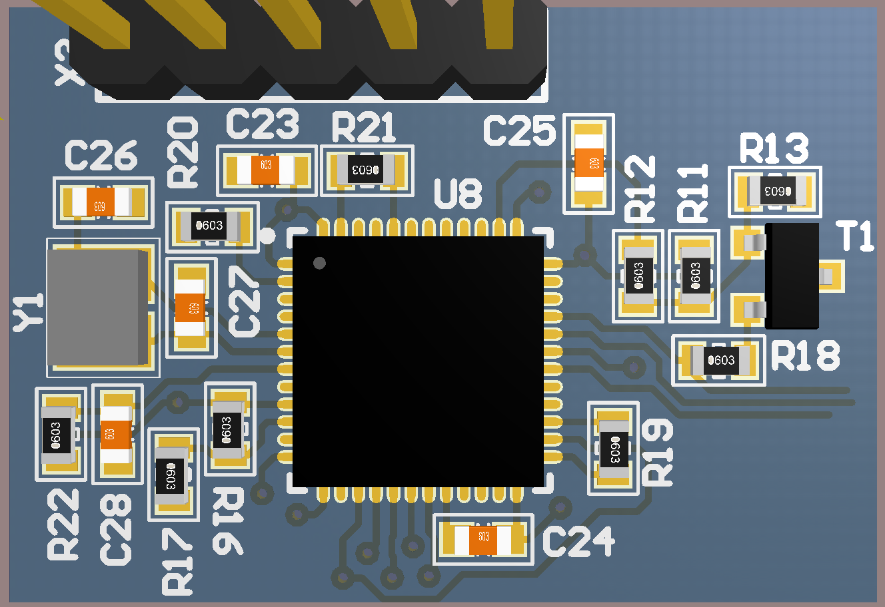

# rlink_core

core of stm32 programmer Jlink or STlink V2.x 

project  programmator included bootloader frimware, software for update and reflash to Jlink / STlink consist [here](https://gitlab.com/RoboticsHardwareSolutions/rlink)

